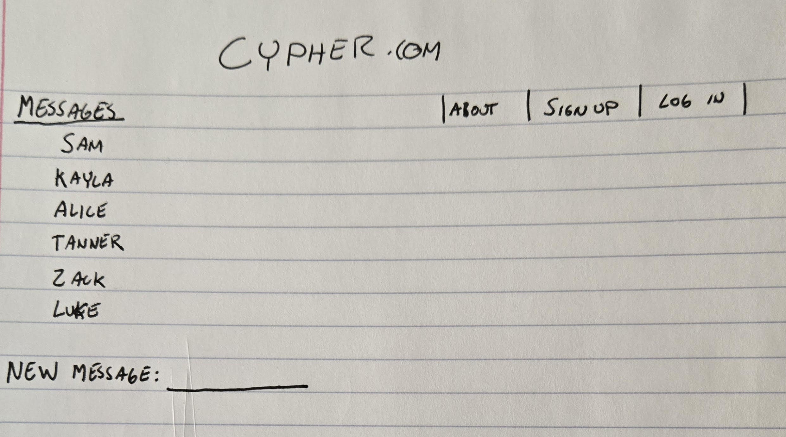

# Cypher Startup

[My Notes](notes.md)

This startup will be a prototype of a secure message transfer website/app. So far, I have working code for sending all text messages, in the future we can incoorperate sending images and video. This project will incoorperate a hybrid of RSA and One-Time_Pad encryption to produce a secure message sharing environment. This website will eventually be converted to an app for a more realistic use model.  

> [!NOTE]
>  If you are not familiar with Markdown then you should review the [documentation](https://docs.github.com/en/get-started/writing-on-github/getting-started-with-writing-and-formatting-on-github/basic-writing-and-formatting-syntax) before continuing.

## 🚀 Specification Deliverable

For this deliverable I did the following. I checked the box `[x]` and added a description for things I completed.

- '[x]' Proper use of Markdown
- '[x]' A concise and compelling elevator pitch
- '[x]' Description of key features
- '[x]' Description of how you will use each technology
- '[x]' One or more rough sketches of your application. Images must be embedded in this file using Markdown image references.

### Elevator pitch

Have you ever wanted to send a potentially risky text, but were afraid that your messaging service was insecure? Worry no more! Get registered at Cypher.com to get peace of mind through secure messeging for free!

### Design

This website is a completly free End to End Encrypted messaging service. It will securelly transmit your messages via a system of encryption that utilises "private" and "public" keys, and RSA encrypted One-Time-Pad decryption keys. Each message has a compeltely new randomly generated One-Time-Pad key, ensuring Cypher's integrety

### User Flow Chart
1. Message Sender Logs In
2. Cypher produces a random RSA "public" and "private" key pair
3. "Private" key is storred on device, "public" key on Cypher database
4. Sender inputs message
5. Cypher produces a random One-Time-Pad style encryption of the Sender's message
6. Cypher encrypts the One-Time-Pad key using RSA
7. Cypher transmits the encrypted key and message to the Receiver
8. Reciever's Cypher account will decrypt the message using their "private" key and the Sender's "public" key
   

### Key features

- One-Time-Pad encryption for each character of each message
- New random One-Time_pad key for each sent message
- RSA assymetric style One-Time-Pad key encryption and transmission

### Technologies

I am going to use the required technologies in the following ways.

- **HTML** - Used for the basic frame of the website
- **CSS** - Used to make the website more visually appealing 
- **React** - Description here
- **Service** - Description here
- **DB/Login** - Used to secure users private and public keys, register accounts, and provide message access across multiple devices
- **WebSocket** - Description here

##I kept the following blocks of text as a reminder of my goals for the rest of the project. 

## 🚀 AWS deliverable

For this deliverable I did the following. I checked the box `[x]` and added a description for things I completed.

- [ ] **Server deployed and accessible with custom domain name** - [My server link](https://yourdomainnamehere.click).

## 🚀 HTML deliverable

For this deliverable I did the following. I checked the box `[x]` and added a description for things I completed.

- [ ] **HTML pages** - I did not complete this part of the deliverable.
- [ ] **Proper HTML element usage** - I did not complete this part of the deliverable.
- [ ] **Links** - I did not complete this part of the deliverable.
- [ ] **Text** - I did not complete this part of the deliverable.
- [ ] **3rd party API placeholder** - I did not complete this part of the deliverable.
- [ ] **Images** - I did not complete this part of the deliverable.
- [ ] **Login placeholder** - I did not complete this part of the deliverable.
- [ ] **DB data placeholder** - I did not complete this part of the deliverable.
- [ ] **WebSocket placeholder** - I did not complete this part of the deliverable.

## 🚀 CSS deliverable

For this deliverable I did the following. I checked the box `[x]` and added a description for things I completed.

- [ ] **Header, footer, and main content body** - I did not complete this part of the deliverable.
- [ ] **Navigation elements** - I did not complete this part of the deliverable.
- [ ] **Responsive to window resizing** - I did not complete this part of the deliverable.
- [ ] **Application elements** - I did not complete this part of the deliverable.
- [ ] **Application text content** - I did not complete this part of the deliverable.
- [ ] **Application images** - I did not complete this part of the deliverable.

## 🚀 React part 1: Routing deliverable

For this deliverable I did the following. I checked the box `[x]` and added a description for things I completed.

- [ ] **Bundled using Vite** - I did not complete this part of the deliverable.
- [ ] **Components** - I did not complete this part of the deliverable.
- [ ] **Router** - I did not complete this part of the deliverable.

## 🚀 React part 2: Reactivity deliverable

For this deliverable I did the following. I checked the box `[x]` and added a description for things I completed.

- [ ] **All functionality implemented or mocked out** - I did not complete this part of the deliverable.
- [ ] **Hooks** - I did not complete this part of the deliverable.

## 🚀 Service deliverable

For this deliverable I did the following. I checked the box `[x]` and added a description for things I completed.

- [ ] **Node.js/Express HTTP service** - I did not complete this part of the deliverable.
- [ ] **Static middleware for frontend** - I did not complete this part of the deliverable.
- [ ] **Calls to third party endpoints** - I did not complete this part of the deliverable.
- [ ] **Backend service endpoints** - I did not complete this part of the deliverable.
- [ ] **Frontend calls service endpoints** - I did not complete this part of the deliverable.
- [ ] **Supports registration, login, logout, and restricted endpoint** - I did not complete this part of the deliverable.

## 🚀 DB deliverable

For this deliverable I did the following. I checked the box `[x]` and added a description for things I completed.

- [ ] **Stores data in MongoDB** - I did not complete this part of the deliverable.
- [ ] **Stores credentials in MongoDB** - I did not complete this part of the deliverable.

## 🚀 WebSocket deliverable

For this deliverable I did the following. I checked the box `[x]` and added a description for things I completed.

- [ ] **Backend listens for WebSocket connection** - I did not complete this part of the deliverable.
- [ ] **Frontend makes WebSocket connection** - I did not complete this part of the deliverable.
- [ ] **Data sent over WebSocket connection** - I did not complete this part of the deliverable.
- [ ] **WebSocket data displayed** - I did not complete this part of the deliverable.
- [ ] **Application is fully functional** - I did not complete this part of the deliverable.
